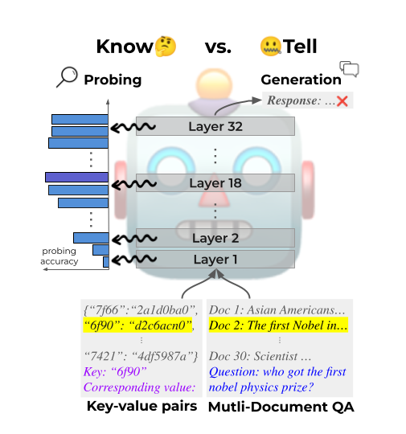

This is the code repository of [Insights into LLM Long-Context Failures: When Transformers Know but Don't Tell](https://arxiv.org/abs/2406.14673)
 
Large Language Models (LLMs) exhibit positional bias, struggling to utilize information from the middle or end of long contexts. Our study explores LLMs' long-context reasoning by probing their hidden representations. We find that while LLMs encode the position of target information, they often fail to leverage this in generating accurate responses. This reveals a disconnect between information retrieval and utilization, a "know but don't tell" phenomenon. We further analyze the relationship between extraction time and final accuracy, offering insights into the underlying mechanics of transformer models.

<p align="center">
  
</p>

If you find this work helpful, please consider citing the following:
```
@misc{lu2024insightsllmlongcontextfailures,
      title={Insights into LLM Long-Context Failures: When Transformers Know but Don't Tell}, 
      author={Taiming Lu and Muhan Gao and Kuai Yu and Adam Byerly and Daniel Khashabi},
      year={2024},
      eprint={2406.14673},
      archivePrefix={arXiv},
      primaryClass={cs.CL},
      url={https://arxiv.org/abs/2406.14673}, 
}
```
